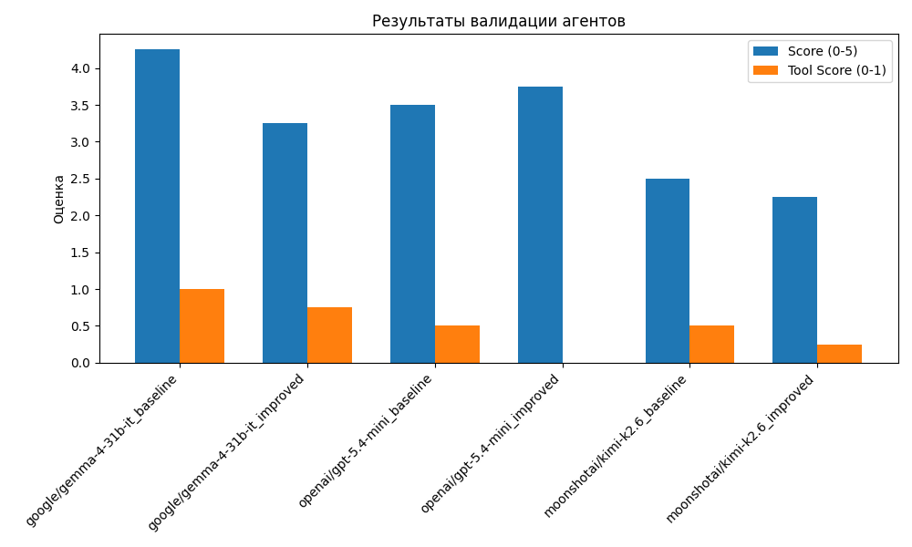

## тестовое задание ингосстрах
**Сам агент**


базовый reAct агент c использованием calculator-mcp-server и wikipedia-mcp (не добавл динамическую подгрузку тулзов, потому что их мало и они не засоряют контекст)


добавил суммаризацию вызовоа вики тулзов(то есть в LLM подается prompt + query + tool_result) чтобы извлекать только полезную информацию и не засорять контекст самого агента


самопроверка вызывает LLM только с запросом и финальным ответом
как базовая модель нормально работает google/gemma-4-31b-it, для сложных вопросов, возможно, нужно использовать модели потяжелее


**Валидация**


 проверка агента на тестовых сценариях (validation_QA.jsonl) с использованием различных моделей и промптов. Ответы агента оцениваются LLM по 5-балльной шкале в сравнении с эталонным ответом, также проверяется факт вызова ожидаемых инструментов(но надо улучшить).

## Запуск

* cli
```bash
cp .env.example .env # дарю апи ключ (там ограничение < 100р)
docker-compose -f deploy/docker-compose.yml run --rm cli
```

* Валидация
```bash
cp .env.example .env # дарю апи ключ (там ограничение < 100р)
docker-compose -f deploy/docker-compose.yml up --build validate
```



## Что бы сделал дальше 
- сделал бы внешнего агента который уже бы мог вызвать wiki-agent, чтобы можно было проверить A2A (без проверки делать A2A не стал)
- поправил тестовые данные 
- написал тест с препромптами имитации работы, чтобы проверить работает ли нормально самопроверка
- распараллелил вызов тулов
- более качественная оценка вызова тулов при валидации, а не просто проверка были ли вызваны те тулы что есть в списке, со сравнением аргументов вызова тулы 
